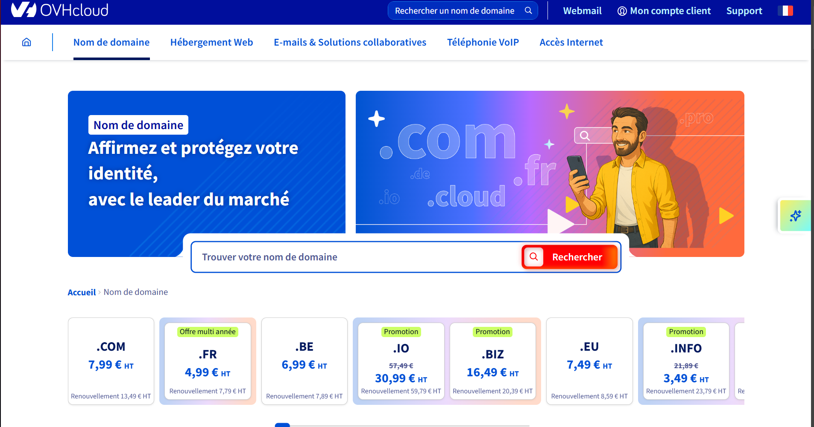
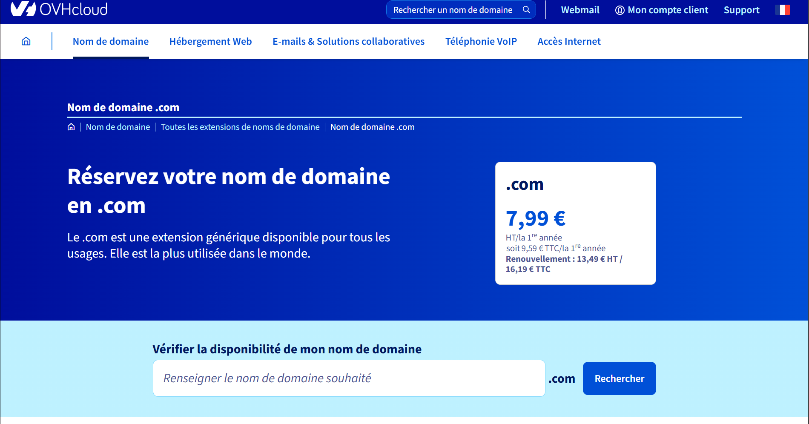
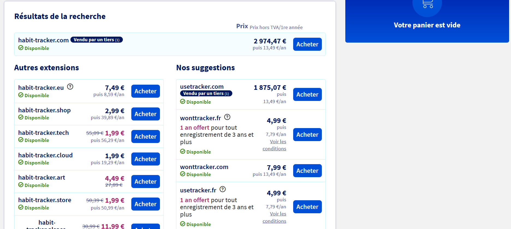
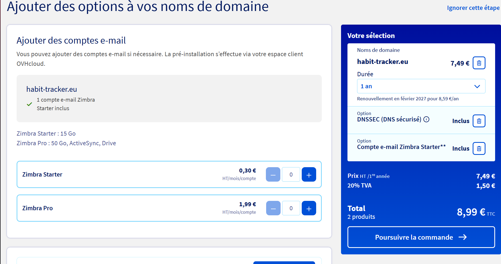

# Questions

Répondez ici aux questions théoriques en détaillant un maxium vos réponses :

1) Expliquer la procédure pour réserver un nom de domaine chez OVH avec des captures d'écran (arrêtez-vous au paiement) :

Je me connecte au site https://www.ovhcloud.com/fr/domains

Je selectionne l'extension désiré, dans cet exemple j'ai choisi .com

Dans le champs "Renseignez le nom de domaine souhaité" je met mon nom de domaine exemple "habit-tracker"
Je m'assure de la disponibilité comme on peux voir içi :

Une fois le nom choisi et la disponibilité vérifié je peux également choisir des options :

Puis je me crée un compte afin de régler le montant indiqué.

2. Comment faire pour qu'un nom de domaine pointe vers une adresse IP spécifique ?

Pour faire pointer un nom de domaine vers une adresse IP spécifique, il faut configurer les enregistrements DNS. Voici la procédure détaillée :

### Accéder à la gestion DNS chez OVH
Connection à mon espace client OVH je vais dans la section "Noms de domaine" je sélectionne le domaine concerné puis je clique sur l'onglet "Zone DNS"

Pour pointer le domaine principal (habit-tracker.com) :
Je choisi le type d'enregistrement, le Nom/Sous-domaine si besoin, je defini mon adresse IP (192.168.23.144)

### Configuration côté serveur (aaPanel)
Une fois les DNS configurés, il faut également configurer le serveur pour je me connecte à aaPanel je vais dans "Website" > "le site créer sur 192.168.23.144"
J'ajoyte le nom de domaine
Puis aaPanel crée automatiquement la configuration Nginx/Apache pour ce domaine

4. Comment mettre en place un certificat SSL ?

### Certificat SSL

Je me connecte à aaPanel, je vais dans "Website", je sure mon site dans la liste et je vais dans "Settings" 
Je vais dans l'onglet "SSL" et je fais "Apply"

### Activation du SSL
Après l'obtention du certificat je dois Cocher "Force HTTPS" pour rediriger automatiquement HTTP vers HTTPS